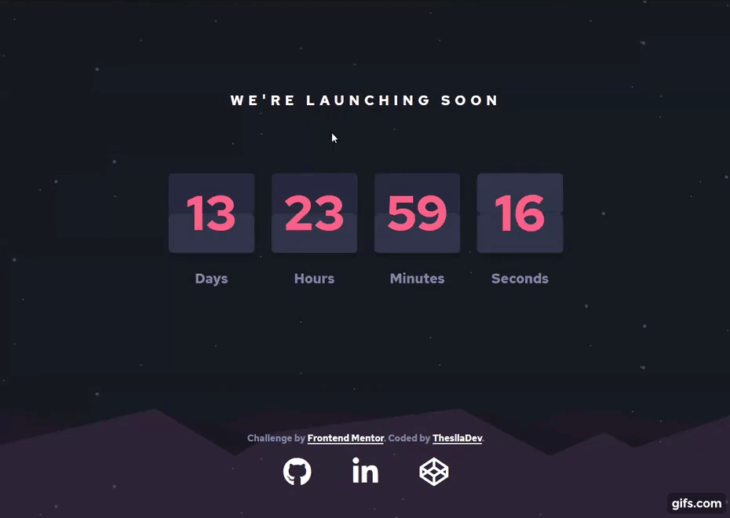

# Launch countdown timer

This is a solution to the [Launch countdown timer challenge on Frontend Mentor](https://www.frontendmentor.io/challenges/launch-countdown-timer-N0XkGfyz-). Frontend Mentor challenges help you improve your coding skills by building realistic projects. 

---

  
       

  <h3>
    <a href="https://theslladev.github.io/Lauch-Countdown-Timer">
      Demo
    </a>
     | 
    <a href="https://your-url-to-the-solution">
      Solution
    </a>
     | 
    <a href="https://www.frontendmentor.io/challenges/launch-countdown-timer-N0XkGfyz-">
      Challenge
    </a>
  </h3>

## Table of contents

- [Launch countdown timer](#launch-countdown-timer)
  - [Table of contents](#table-of-contents)
  - [Overview](#overview)
    - [The challenge](#the-challenge)
    - [Links](#links)
  - [My process](#my-process)
    - [Built with](#built-with)
    - [What I learned](#what-i-learned)
    - [Useful resources](#useful-resources)
  - [👷 Author](#-author)

## Overview

### The challenge

Users should be able to:

- See hover states for all interactive elements on the page
- See a live countdown timer that ticks down every second (start the count at 14 days)
- **Bonus**: When a number changes, make the card flip from the middle

### Links

- Solution URL: [Solution in Frontend Mentor](#)
- Live Site URL: [Launch-Countdown-Timer](https://theslladev.github.io/Launch-Countdown-Timer)

## My process

### Built with

- [HTML5](https://www.w3schools.com/tags/default.asp)
  - Semantic HTML5 markup
- [CSS3](https://www.w3schools.com/w3css/defaulT.asp)
  - Flex Box
  - Mobile-first workflow
  - Responsive layout
  - [SASS](https://sass-lang.com/)
- [JavaScript](https://developer.mozilla.org/en-US/docs/Web/JavaScript)
  - Dom manipulation
  - [ES6(ECMAScript)](https://www.w3schools.com/js/js_es6.asp)
  - Events
  - Functions
  - Objects
  - [GSAP](https://greensock.com/)
- [FontAwesome](https://fontawesome.com/)
- [Google Fonts](https://fonts.google.com/)

### What I learned

I learned to work with the date and time method in JS, about ECMAScript6, events, functions, objects and the GSAP library

### Useful resources

- [How TO - JavaScript Countdown Timer](https://www.w3schools.com/howto/howto_js_countdown.asp)
- [GSAP](https://greensock.com/)

## 👷 Author

<a href="https://github.com/ThesllaDev">
 
  
 <b>Thalles Augusto</b></a>

Made with ❤️ by Thalles Augusto 👋🏽 Contact me!  
 
